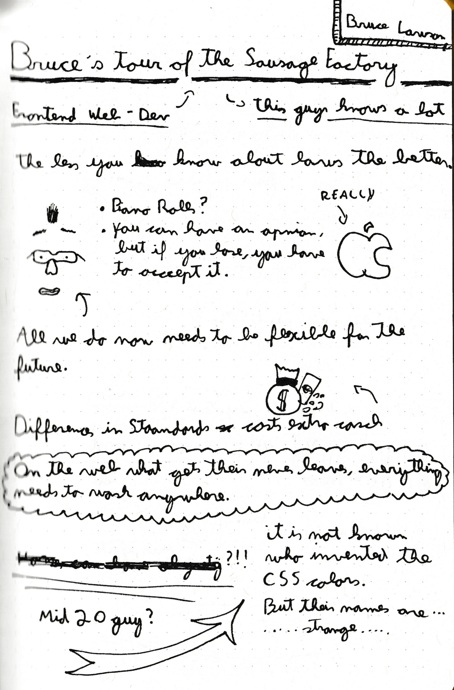
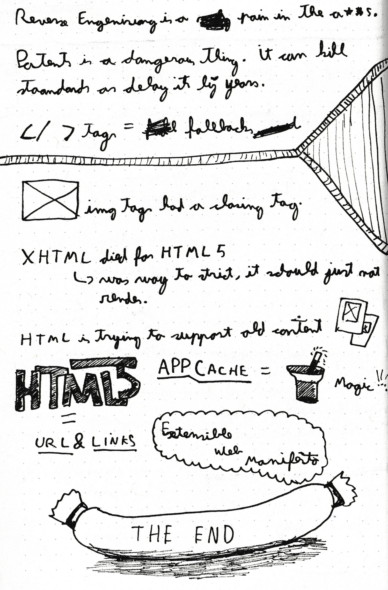

[Back <](../README.md)

# #12 - Bruce Lawson (W3C) - Current State

## Interesting Subjects & Facts

- This guy is strange... From Vitaly Friedman's viewport, this is a great thing!
- Everything we build now needs to be flexible and future-proof.
- Differences in web standards can cost a lot of money.
- CSS color names are great porn star names.
- Patents are dangerous and can kill web standards.
- AppCache & Service Workers.
- SAUSAGES

[Back <](../README.md)
