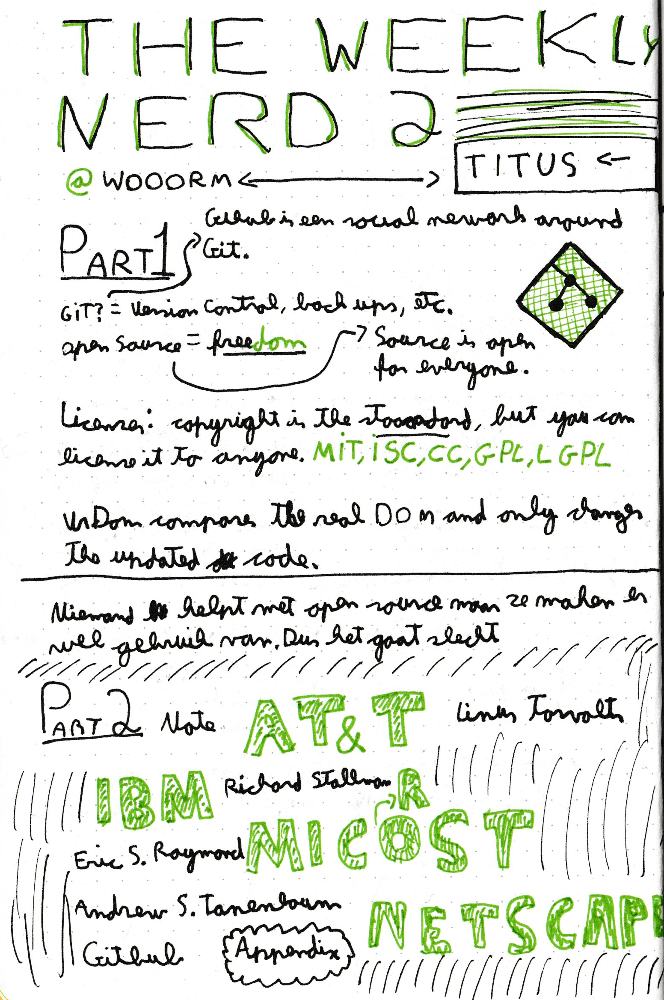

[Back <](../README.md)

# #2 Titus Wormer (HvA) - Advanced Git Tips & Tricks

## Interesting Subjects & Facts

- GitHub is just a social network build around Git.
- Version Control & Open Source.
- Open Source is not doing well.
- A lot of big names are involved, for example, At&T, IBM, Microsoft & Netscape.

[Back <](../README.md)
