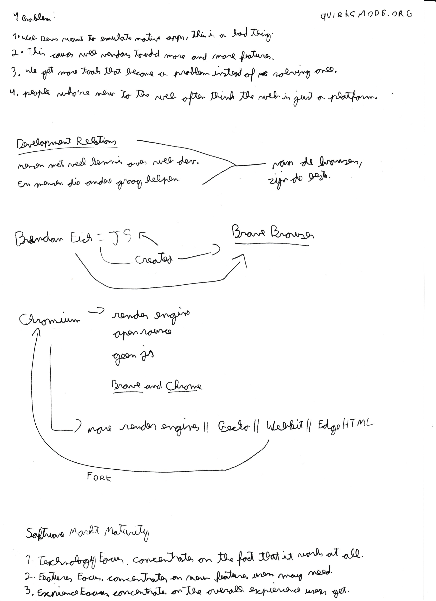

[Back <](../README.md)

# #3 Peter Paul Koch (PPK) - Browser bloat

## Interesting Subjects & Facts

- Web developers want to emulate native applications and this is a bad thing.
- The platform is becoming very complicated for newcomers.
- Chromium, Webkit, EdgeHTML & Gecko.
- Brendan Eich created JavaScript for Netscape.

[Back <](../README.md)
