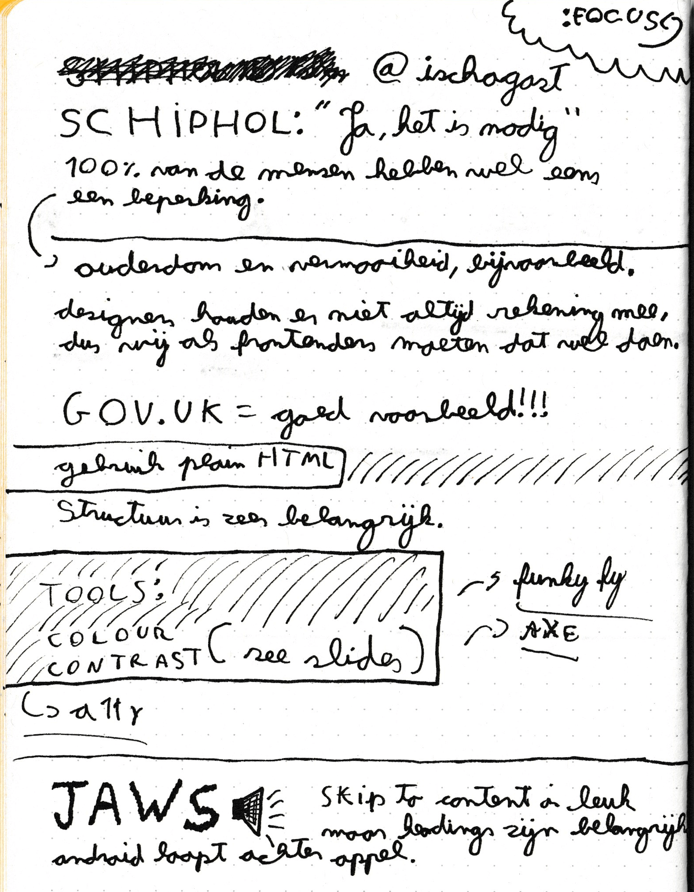

[Back <](../README.md)

# #6 Ischa Gast (Schiphol) - Accessibility

## Interesting Subjects & Facts

- 100% of the people have some kind of disability.
- Designers ignore accessibility so we front-enders need to design around it.
- HTML structure is extremely important.
- JAWS.

[Back <](../README.md)
